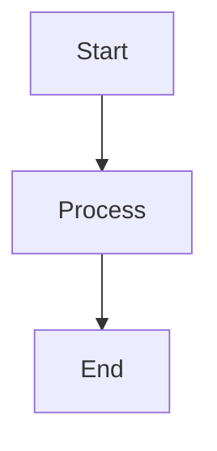
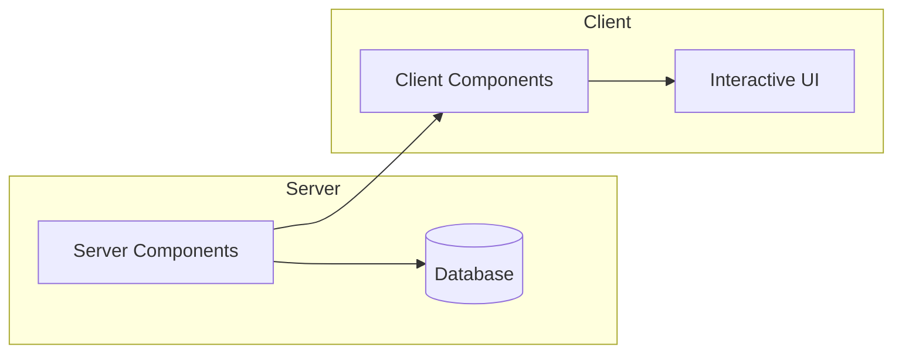

# Blog Post Template

Create blog posts with a consistent structure for the user's Strapi-powered website.

## Output Format

All content goes into a single markdown document (for the Strapi `content` field).

### Structure

```markdown
**This post is based on the following video:**

https://youtube.com/watch?v=VIDEO_ID

**TL;DR**

- Key takeaway one
- Key takeaway two
- Key takeaway three

[Main content body...]

**Citations**

- Source Title: https://example.com/source1
- Another Source: https://example.com/source2
```

### Section Rules

1. **YouTube Video Section** (conditional)
   - Only include when the user explicitly states the post is based on a YouTube video
   - Use exact text: `**This post is based on the following video:**`
   - Place the URL on its own line (no markdown link formatting) so the frontend can parse and embed it
   - This section comes first, before TL;DR

2. **TL;DR Section** (required)
   - Use `**TL;DR**` as the label (bold, not a heading)
   - Bulleted list of 3-5 key takeaways
   - Keep each bullet concise (1-2 sentences max)

3. **Main Content** (required)
   - Search the web for relevant, current information on the topic
   - Enrich with additional context, examples, and insights beyond the source material
   - For technical posts:
     - Include code examples with proper syntax highlighting
     - Include Mermaid.js diagrams where helpful (frontend renders them)
   - Use clear structure with `##` headings for major sections
   - Write in an engaging, accessible style

4. **Citations Section** (required)
   - Use `**Citations**` as the label (bold, not a heading)
   - Format: `- Source Title: https://url.com`
   - Include all sources referenced (web search results, YouTube video if applicable, etc.)
   - Each citation on its own line

## Workflow

1. If user provides a YouTube URL, note it for the video section
2. Search the web for relevant information on the topic
3. Draft the TL;DR bullets summarizing key points
4. Write the main content, enriching with research findings
5. For technical topics, add code examples and Mermaid diagrams
6. Compile citations from all sources used
7. Assemble final markdown in the correct structure

## Technical Content Guidelines

When the post is technical (programming, architecture, systems, etc.):

**Code Examples:**
```typescript
// Use appropriate language tags
function example(): string {
  return "Use real, working code examples";
}
```

**Mermaid Diagrams:**


Use Mermaid for:
- Architecture diagrams
- Flow charts
- Sequence diagrams
- Entity relationships
- State machines

## Example Output

```markdown
**This post is based on the following video:**

https://youtube.com/watch?v=dQw4w9WgXcQ

**TL;DR**

- React Server Components reduce client-side JavaScript by running on the server
- Use 'use client' directive only for interactive components
- Data fetching moves to the server, eliminating most useEffect calls

## What Are React Server Components?

React Server Components (RSC) represent a fundamental shift in how we build React applications...

[content continues...]

## When to Use Client Components

Not everything belongs on the server. Use client components when you need:

```tsx
'use client'

import { useState } from 'react';

export function Counter() {
  const [count, setCount] = useState(0);
  return <button onClick={() => setCount(c => c + 1)}>{count}</button>;
}
```

## Architecture Overview



[content continues...]

**Citations**

- React Server Components RFC: https://github.com/reactjs/rfcs/blob/main/text/0188-server-components.md
- Next.js Documentation: https://nextjs.org/docs/app/building-your-application/rendering/server-components
- Understanding RSC: https://example.com/rsc-deep-dive
```
