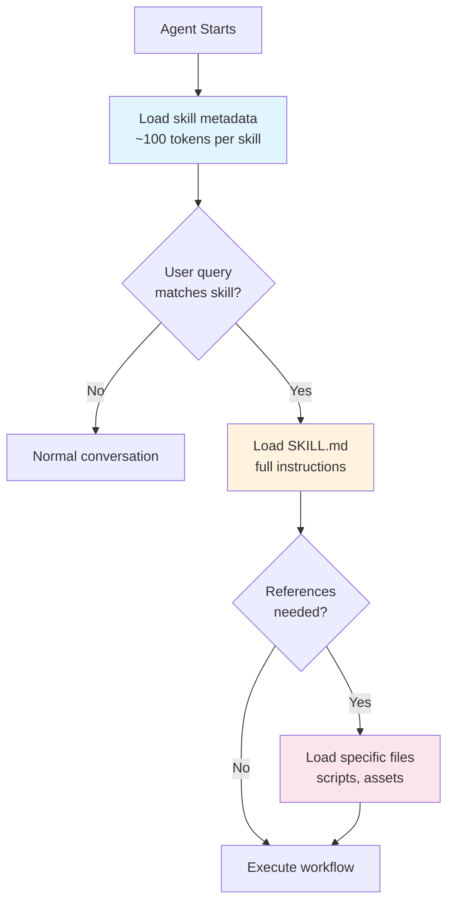
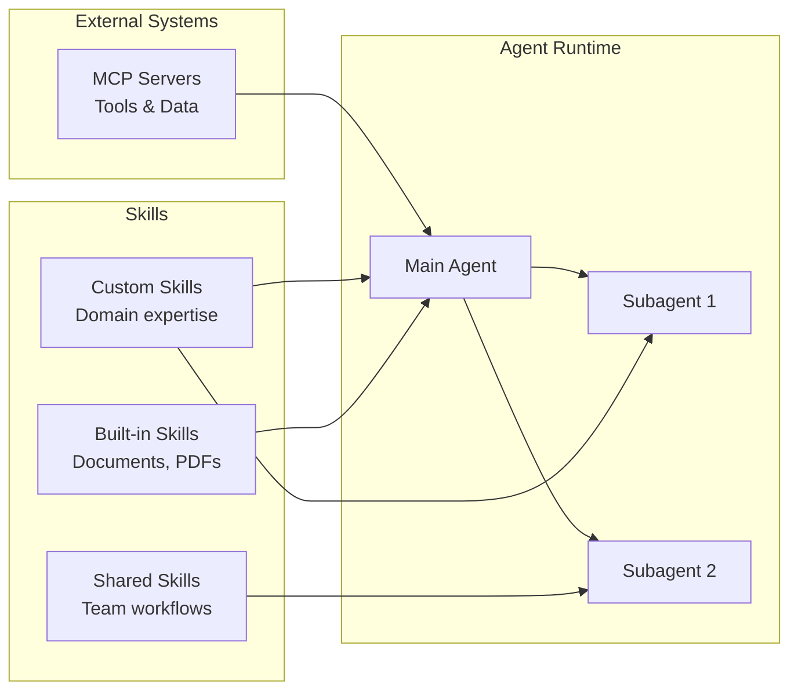
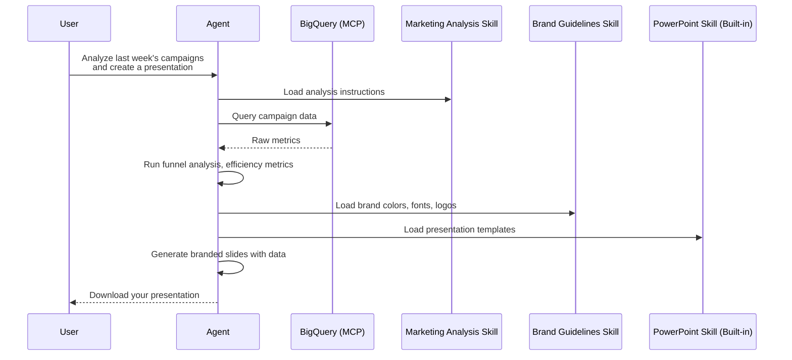

**TL;DR**

- Agent Skills are an open standard for packaging reusable workflows, domain expertise, and new capabilities into portable folders that any AI agent can discover and use
- Skills use progressive disclosure to protect the context window — only loading the name and description at startup, then the full instructions and resources on demand
- The standard is supported by 26+ platforms including Claude, Claude Code, OpenAI Codex, Gemini CLI, GitHub Copilot, Cursor, and VS Code
- Building a skill is straightforward: create a folder with a `SKILL.md` file containing YAML frontmatter (name + description) and markdown instructions, plus optional `scripts/`, `references/`, and `assets/` subdirectories
- Skills are composable — combine custom skills with built-in ones and MCP servers to create powerful, predictable workflows

## What Are Agent Skills?

If you've ever found yourself pasting the same prompt into Claude over and over — a weekly report format, a code review checklist, a data analysis workflow — you've already felt the problem that skills solve.

**Agent Skills are folders of instructions** that package repeated workflows, specialized knowledge, or new capabilities for your AI agent. Instead of copying and pasting lengthy prompts every session, you write them once as a skill and reuse them forever.

But skills aren't just "saved prompts." They're an **open standard** originally created by Anthropic and now governed as a cross-platform specification at [agentskills.io](https://agentskills.io). This means a skill you build for Claude works identically in OpenAI Codex, Gemini CLI, GitHub Copilot, Cursor, and over 20 other platforms.

Think of it this way: **MCP gives your agent access to external tools and data. Skills teach your agent *what to do* with those tools and data.**

## Why Skills Matter

### The Problem with Raw Prompts

Consider a content creator who publishes blog posts every week. Without skills, every conversation starts the same way:

1. Paste the blog post structure rules (TL;DR section, heading hierarchy, citations format)
2. Paste the SEO guidelines (keyword density, meta description format, internal linking rules)
3. Paste the brand voice instructions (tone, audience, formatting preferences)
4. Paste or describe the topic and source material
5. Hope the output actually follows all those rules consistently

This approach has three major issues:

- **Context window pollution** — Every piece of instruction consumes tokens, leaving less room for actual content creation
- **No portability** — The workflow lives in your clipboard, not in a shareable, versioned artifact
- **No consistency** — Different team members will paste different versions of the instructions, and the output quality varies from session to session

### What Skills Solve

Skills address all three problems by introducing:

- **Progressive disclosure** — Only the skill name and description are loaded at startup. The full instructions load only when the skill is triggered. Referenced files and scripts load only when needed during execution
- **Portability** — A skill is a folder. Share it via zip file, Git repository, or marketplace. It works across 26+ platforms
- **Repeatability** — The same instructions execute the same way every time, for every team member



This three-tier loading model means you can have **hundreds of skills installed** without any performance impact — the agent only pays the token cost for skills it actually uses.

## The Agent Skills Ecosystem

Skills don't exist in isolation. They're one piece of a larger agent architecture:



| Component | What It Does | When to Use |
|-----------|-------------|-------------|
| **Prompts** | The atomic unit of communication | Single, one-off instructions |
| **Skills** | Packaged workflows with domain expertise | Repeatable tasks, team-wide processes |
| **MCP** | Connects agents to external tools and data | Database access, APIs, file systems |
| **Subagents** | Isolated execution with their own context | Parallel tasks, specialized analysis |
| **Tools** | Low-level capabilities (bash, filesystem) | The building blocks that power everything |

The analogy is simple: **tools are the hammer and saw, skills are the blueprint for building the bookshelf.** Skills can reference MCP servers for data, dispatch subagents for parallel execution, and invoke scripts — all while keeping the context window clean.

## How Skills Work Under the Hood

Every skill follows the same structure, defined by the [Agent Skills Specification](https://agentskills.io/specification):

```
my-skill/
├── SKILL.md              # Required — instructions + YAML frontmatter
├── scripts/              # Optional — executable code
├── references/           # Optional — additional documentation
└── assets/               # Optional — templates, images, data files
```

### The SKILL.md File

This is the only required file. It has two parts:

**1. YAML Frontmatter** — metadata that tells the agent what this skill is and when to use it:

```yaml
---
name: analyzing-marketing-campaign
description: >-
  Analyze weekly marketing campaign performance from CSV or BigQuery data.
  Use when the user asks about campaign metrics, funnel analysis, ROAS,
  or budget reallocation.
---
```

**2. Markdown Body** — the actual instructions, as detailed as you need:

```markdown
# Weekly Campaign Analysis

## Input Requirements
- Campaign data with columns: date, campaign_name, impressions, clicks, conversions
- Date range must be specified (do not use full range without user confirmation)

## Step 1: Data Quality Check
- Verify no missing values in required columns
- Flag any anomalies (CTR > 20%, negative values, etc.)

## Step 2: Funnel Analysis
Calculate against these benchmarks:
| Metric | Benchmark |
|--------|-----------|
| CTR    | 2.5%      |
| CVR    | 3.0%      |

[... detailed instructions continue ...]

## Budget Reallocation
Only when the user asks about budget reallocation, read:
`references/budget_reallocation_rules.md`
```

Notice that last line — the budget reallocation rules are in a separate file that **only loads when the user asks about it**. That's progressive disclosure in action.

### Required vs Optional Fields

| Field | Required | Description |
|-------|----------|-------------|
| `name` | Yes | 1-64 chars, lowercase + hyphens, must match folder name |
| `description` | Yes | 1-1024 chars, describes *what* and *when* |
| `license` | No | e.g., `Apache-2.0` |
| `compatibility` | No | Environment requirements, e.g., `Requires python3` |
| `metadata` | No | Arbitrary key-value pairs (author, version, etc.) |
| `allowed-tools` | No | Pre-approved tool list for the skill |

### Naming Conventions

- Use lowercase letters, numbers, and hyphens only
- Use the `verb-ing + noun` pattern: `analyzing-marketing-campaign`, `generating-practice-questions`
- Don't use reserved keywords like `claude` or `anthropic`

## How to Build a Skill: A Walkthrough

Let's break down how to build a production-quality skill by examining the structure and key decisions behind a real example — a **Strapi Configuration Skill** that scaffolds fully configured Strapi CMS projects. You don't need to recreate this exact skill (the full source is available in the [repository](https://github.com/anthropics/skills) if you want to explore it), but it demonstrates every important concept you need to build your own.

### Step 1: Define the Folder Structure

Start by creating your skill directory:

```
strapi-configuration/
├── SKILL.md                  # The core instructions
├── CLAUDE.md                 # Development context (optional but helpful)
├── README.md                 # User-facing documentation
├── scripts/                  # Executable code (empty for now)
├── references/               # Additional docs (empty for now)
└── templates/                # Domain-specific assets
    ├── blog.json
    ├── ecommerce.json
    ├── portfolio.json
    └── restaurant.json
```

The standard directories are `scripts/`, `references/`, and `assets/`. You can also add domain-specific directories — here, `templates/` holds JSON preset definitions that the skill reads dynamically.

### Step 2: Write the YAML Frontmatter

This is the most critical part. The name and description are **the only things loaded into context at startup**, so they determine whether the agent recognizes when to use your skill:

```yaml
---
name: strapi-configuration
description: >-
  Create a fully configured Strapi project with preconfigured content types,
  seed data, public API access, and route-based middleware for default
  population. Use when the user wants to scaffold a new Strapi project for
  a specific use case such as blog, e-commerce, portfolio, or restaurant.
  Supports preset templates and custom project descriptions.
compatibility: Requires Node.js
allowed-tools: Bash Read Write Edit Glob Grep
metadata:
  author: strapi
  version: "0.1.0"
---
```

**Key decisions here:**

- The **description** contains trigger keywords: "scaffold", "Strapi project", "blog", "e-commerce", "portfolio", "restaurant". When a user mentions any of these, the agent knows to activate this skill
- **`allowed-tools`** declares upfront which tools the skill needs — this is important for security-conscious environments
- **`compatibility`** tells the agent (and the user) what the runtime requirements are

### Step 3: Structure the Instructions as a Step-by-Step Workflow

The body of `SKILL.md` should read like a precise recipe. The Strapi skill breaks execution into 9 sequential steps:

```markdown
## Execution Steps

When the user invokes this skill, follow these steps **in order**:

### Step 1: Parse Arguments and Select Template
Extract the output path. Present a selection menu to the user...

### Step 2: Read the Template
Read the template JSON file at `templates/<preset>.json`...

### Step 3: Create the Strapi Project
Run the CLI: `node packages/cli/.../index.js <path> --non-interactive`

### Step 4: Generate Content Type Schemas
For each content type, create the full API structure...

### Step 5: Generate Middleware Files
### Step 6: Generate Component Files
### Step 7: Generate Seed Script
### Step 8: Add Seed Script to package.json
### Step 9: Summary
```

This step-by-step format is a best practice for skills that need deterministic execution. Each step has:

- **Clear entry/exit criteria** — what input it needs, what output it produces
- **Exact code templates** — not vague descriptions, but literal TypeScript/JSON the agent should write
- **Conditional branches** — Step 2 has a "Step 2b" for custom projects vs presets

### Step 4: Use Progressive Disclosure for Reference Files

The skill doesn't dump all template data into the instructions. Instead, it tells the agent where to find them:

```markdown
### Step 2: Read the Template

Read the template JSON file at `templates/<preset>.json`.

The template contains:
- `contentTypes` - Collection types and single types
- `components` - Reusable component definitions
- `middlewares` - Route-based populate configs
- `seedData` - Sample data entries
- `publicPermissions` - Public API endpoint config
```

The agent reads the specific template file only when it needs it. With four templates at ~23KB each, this saves ~70KB of context tokens that would otherwise be wasted.

### Step 5: Include Code Templates for Predictable Output

For technical skills, include exact code patterns. Don't say "create a controller" — show the exact code:

```markdown
**Controller** (`<name>.ts`):

\```typescript
import { factories } from '@strapi/strapi';

export default factories.createCoreController('api::<name>.<name>');
\```
```

This eliminates guesswork and ensures the agent produces code that actually works with the target framework.

### Step 6: Handle Branching Logic

Real workflows aren't always linear. The Strapi skill handles two distinct paths — preset-based and custom:

```markdown
### Step 2b: Custom Project Generation

When the user provides a description instead of a preset:

1. Gather requirements (ask 1-2 clarifying questions)
2. Design the content model (following patterns from existing templates)
3. Generate all template data in memory
4. Generate seed data (2-5 realistic entries per type)
5. Design middleware populate configs
6. Set public permissions
7. Optionally save as a reusable template
```

This branching is clearly marked and self-contained — the agent knows exactly which path to follow.

### Key Takeaways for Building Your Own Skills

Here are the principles that make the difference between a skill that works sometimes and one that works reliably:

**1. Invest heavily in the description.** This is your skill's "elevator pitch" to the agent. Include trigger keywords, use cases, and what the skill does NOT do.

**2. Be explicit, not abstract.** Instead of "generate appropriate files," specify exactly which files, in which directories, with which content patterns.

**3. Use progressive disclosure aggressively.** If a piece of information is only needed 20% of the time, put it in a reference file.

**4. Provide code templates, not descriptions.** Agents produce more reliable output when they can pattern-match against exact examples.

**5. Number your steps.** Sequential numbering creates a clear execution path and makes debugging easier when something goes wrong.

**6. Keep SKILL.md under 500 lines.** If it's growing beyond that, move content into `references/` or `scripts/`.

**7. Add a `CLAUDE.md` for development context.** This file captures conventions, common pitfalls, and testing commands — useful for both the agent and human developers maintaining the skill.

**8. Test with the skill-creator.** Run your skill through Anthropic's built-in skill-creator skill to check against best practices. It scores your skill and provides specific recommendations.

## Where Skills Live

Skills can be installed at different scopes depending on your needs:

| Scope | Location | Use Case |
|-------|----------|----------|
| **Project** | `<project>/.claude/skills/` | Team-specific workflows tied to a codebase |
| **User** | `~/.claude/skills/` | Personal skills available across all projects |
| **Claude AI** | Settings > Capabilities > Skills | Upload as zip, available in the Claude web UI |
| **Marketplace** | `anthropics/skills` on GitHub | Community and official skills you can install |

In Claude Code, you can install skills from the marketplace:

```bash
# Add the Anthropic skills marketplace
/plugins marketplace add anthropics/skills

# Then enable specific skill collections
```

After installation, verify your skills are loaded with the `/skills` command.

## Built-In Skills Worth Knowing

Anthropic ships several production-ready skills:

| Skill | What It Does |
|-------|-------------|
| **Excel** | Create, edit, and analyze `.xlsx` spreadsheets with formatting and charts |
| **PowerPoint** | Generate presentations with custom layouts, colors, and typography |
| **Word** | Create formatted `.docx` documents |
| **PDF** | Extract text, fill forms, merge PDFs, convert to images |
| **Skill Creator** | Meta-skill that creates new skills following best practices |

The document skills (Excel, PowerPoint, Word, PDF) are built into Claude AI and always active. The skill-creator is enabled by default. Additional example skills (code review, data analysis, etc.) can be toggled on in Settings > Capabilities.

## Composing Skills for Complex Workflows

The real power of skills emerges when you combine them. Consider this workflow that chains three skills together:



In this flow:
- The **MCP server** provides the connection to BigQuery
- The **marketing analysis skill** defines *how* to analyze the data
- The **brand guidelines skill** defines *how things should look*
- The **built-in PowerPoint skill** handles the *document generation*

Each skill loads only its own context, only when needed. The agent orchestrates everything.

## Skills vs MCP vs Subagents: When to Use What

| Scenario | Use |
|----------|-----|
| Need data from an external database or API | **MCP** |
| Need a repeatable, documented workflow | **Skills** |
| Need parallel execution with isolated context | **Subagents** |
| Need to teach the agent your company's process | **Skills** |
| Need real-time access to Google Drive / Slack / etc. | **MCP** |
| Need specialized analysis that shouldn't pollute main context | **Subagents + Skills** |
| Need a one-off quick task | **Just a prompt** |

The sweet spot is usually a combination: MCP servers bring in the data and tools, skills define the workflows, and subagents handle parallelization when needed.

## Getting Started: Your First Skill in 5 Minutes

Ready to build your first skill? Here's the minimal setup:

**1. Create the folder:**
```bash
mkdir -p .claude/skills/my-first-skill
```

**2. Create `SKILL.md`:**
```markdown
---
name: my-first-skill
description: >-
  Describe what your skill does and when to trigger it.
  Include keywords that users are likely to say.
---

# My First Skill

## Steps

### Step 1: [First thing to do]
[Detailed instructions...]

### Step 2: [Second thing to do]
[Detailed instructions...]

## Output Format
[What the final result should look like]
```

**3. Add reference files if needed:**
```bash
mkdir -p .claude/skills/my-first-skill/references
# Add any additional docs here
```

**4. Test it** by starting a new Claude Code session and asking a question that matches your skill's description.

**5. Iterate.** Run it through the skill-creator for best-practice feedback, and refine based on actual usage.

## What's Next

Agent Skills are still evolving rapidly. The specification is open and accepting contributions at [github.com/agentskills/agentskills](https://github.com/agentskills/agentskills). With 26+ platforms already adopting the standard, skills you build today are an investment that works everywhere.

Whether you're automating a weekly report, encoding your team's code review process, or building a project scaffolding tool, skills transform one-off prompts into durable, shareable, composable knowledge. And the best part — you don't need to be a developer to create one. If you can write a clear set of instructions in markdown, you can build a skill.

**Citations**

- Agent Skills Specification: https://agentskills.io/specification
- Introducing Agent Skills (Anthropic): https://www.anthropic.com/news/skills
- Equipping Agents for the Real World with Agent Skills: https://www.anthropic.com/engineering/equipping-agents-for-the-real-world-with-agent-skills
- Agent Skills GitHub Repository: https://github.com/anthropics/skills
- Agent Skills Open Standard Repository: https://github.com/agentskills/agentskills
- Claude Code Skills Documentation: https://code.claude.com/docs/en/skills
- OpenAI Codex Skills Documentation: https://developers.openai.com/codex/skills/
- Gemini CLI Skills Documentation: https://geminicli.com/docs/cli/skills/
- DeepLearning.AI Course Notes (source material)
