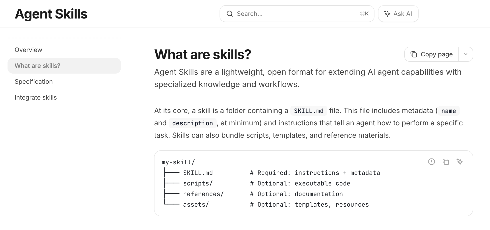
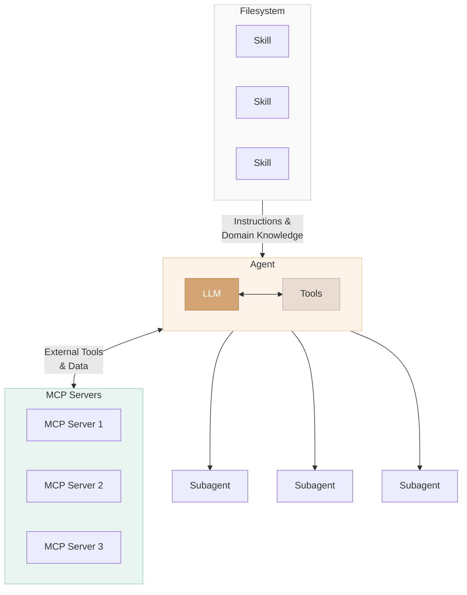
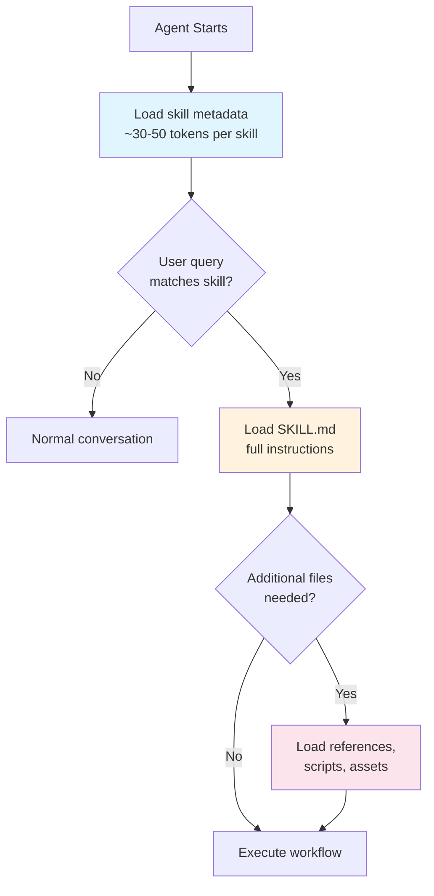
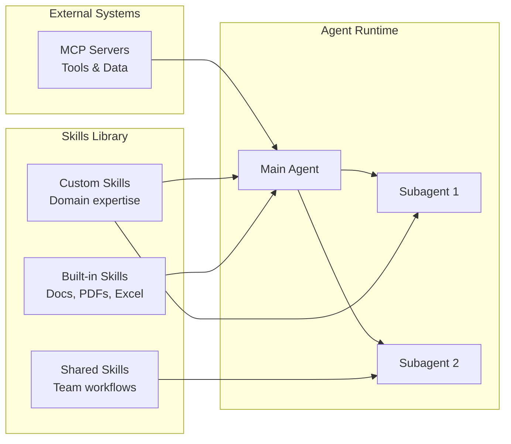
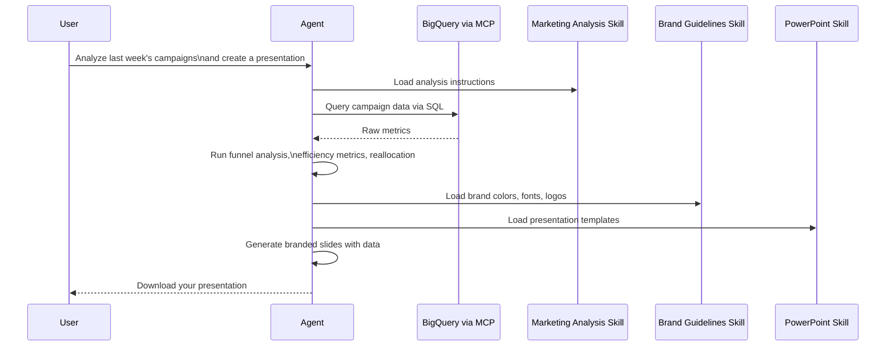
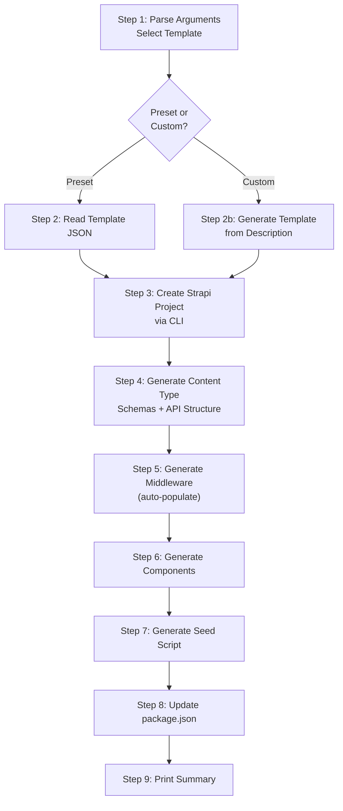

**TL;DR**

- Agent Skills are an open standard for packaging reusable workflows, domain expertise, and new capabilities into portable folders that any AI agent can discover and use — think of them as "saved prompts" on steroids
- Skills use a three-tier progressive disclosure model to protect the context window: only the name and description load at startup (~30-50 tokens per skill), the full SKILL.md loads when triggered, and reference files load only when needed during execution
- Originally created by Anthropic, skills are now an open standard at agentskills.io, adopted by 26+ platforms including Claude, OpenAI Codex, Gemini CLI, GitHub Copilot, Cursor, and VS Code
- A skill is just a folder with a `SKILL.md` file (YAML frontmatter + markdown instructions) plus optional `scripts/`, `references/`, and `assets/` directories — you can build one in minutes
- Skills are composable: combine custom skills with built-in document skills and MCP servers to build complex, predictable workflows that produce consistent output every time

## What Are Agent Skills?

If you find yourself typing the same prompt across conversations — a weekly report format, a code review checklist, a data analysis pipeline — you've already felt the problem that skills solve. Agent Skills are folders of instructions that package repeated workflows, specialized knowledge, or new capabilities for your AI agent. Instead of copying and pasting lengthy prompts every session, you write them once as a skill and reuse them across every conversation.



But skills go far beyond "saved prompts." They're an **open standard** originally created by Anthropic and now governed as a cross-platform specification at [agentskills.io](https://agentskills.io). On December 18, 2025, Anthropic released Agent Skills as an open standard, publishing the specification and SDK for any AI platform to adopt. This means a skill you build for Claude works identically in OpenAI Codex, Gemini CLI, GitHub Copilot, Cursor, VS Code, and over 20 other platforms that have adopted the standard.

The simplest way to think about it: **MCP gives your agent access to external tools and data. Skills teach your agent *what to do* with those tools and data.**



- **Filesystem** (left) — Skills that provide instructions and domain knowledge to the agent
- **Agent** (center) — Contains the LLM and Tools working together
- **MCP Servers** (right) — External tools and data connections
- **Subagents** (bottom) — Spawned by the main agent for parallel/specialized work

The diagram shows the key relationship: Skills flow *into* the agent as knowledge, MCP connects *bidirectionally* for external capabilities, and Subagents are dispatched *from* the agent. This visually reinforces the point: **MCP gives your agent access to external tools and data. Skills teach your agent *what to do* with those tools and data.**

## Why Skills Matter: From Prompts to Packages

### The Prompt Repetition Problem

Consider a content creator who publishes blog posts every week. Without skills, every conversation starts the same way:

1. Paste the blog post structure rules (TL;DR section, heading hierarchy, citations format)
2. Paste the SEO guidelines (keyword density, meta description format, internal linking rules)
3. Paste the brand voice instructions (tone, audience, formatting preferences)
4. Paste or describe the topic and source material
5. Hope the output actually follows all those rules consistently

Now multiply that across a team of five writers, each with their own slightly different version of those instructions. The output quality varies from session to session and person to person.

This approach has three fundamental issues:

- **Context window pollution** — Every piece of instruction you paste consumes tokens that could be used for actual content. The more instructions you front-load, the faster your context fills up and the higher the likelihood of degradation in response quality
- **No portability** — Your workflow lives in your clipboard or a shared doc somewhere, not in a versioned, shareable artifact that can be installed and used consistently
- **No consistency** — Without a standardized format, different people will interpret and paste those instructions differently, and you can never guarantee the agent follows every rule every time

### How Skills Fix This

Skills address all three problems:

- **Progressive disclosure** — Only the skill's name and description are loaded at startup (roughly 30-50 tokens per skill). The full instructions load only when the skill is triggered. Referenced files, scripts, and assets load only when needed during execution. You can have hundreds of skills installed without any impact on performance
- **Portability** — A skill is a folder. Share it as a zip file, push it to a Git repository, or publish it to a marketplace. Since it's an open standard, it works across Claude, Codex, Gemini CLI, and every other platform that supports the spec
- **Repeatability** — The same instructions execute the same way every time, for every team member, across every platform. In a non-deterministic system where you can never fully predict the model's output, skills provide the structure to make workflows as predictable as possible



Anthropic frames the context window as a **public good** — the more data you add, the more tokens you consume, the faster it fills, and the greater the risk of context degradation. Progressive disclosure is what makes skills fundamentally different from just pasting a big prompt. Skills are intentional about what information goes into the context window and what stays on disk until it's actually needed.

## The Anatomy of a Skill

Every skill follows the same structure, defined by the [Agent Skills Specification](https://agentskills.io/specification):

```
my-skill/
├── SKILL.md              # Required — YAML frontmatter + markdown instructions
├── scripts/              # Optional — executable code (Python, Bash, JS)
├── references/           # Optional — additional documentation
└── assets/               # Optional — templates, images, logos, data files
```

### The SKILL.md File

This is the only required file. It has two parts:

**1. YAML Frontmatter** — metadata that tells the agent what this skill is and when to use it:

```yaml
---
name: analyzing-marketing-campaign
description: >-
  Analyze weekly marketing campaign performance from CSV or BigQuery data.
  Use when the user asks about campaign metrics, funnel analysis, ROAS,
  or budget reallocation.
---
```

The `name` and `description` are the only two required fields. The name must be 1-64 characters, lowercase with hyphens, and should match the folder name. The description (up to 1,024 characters) is mission critical — it's how the agent detects when to activate the skill. Include trigger keywords and describe not just what the skill does, but *when* to use it.

Optional frontmatter fields include `license`, `compatibility` (environment requirements), `metadata` (arbitrary key-value pairs like author and version), and `allowed-tools` (pre-approved tool list for security-conscious environments).

**2. Markdown Body** — the actual instructions, as detailed as you need:

```markdown
# Weekly Campaign Analysis

## Input Requirements
- Campaign data with columns: date, campaign_name, impressions, clicks, conversions
- Date range must be specified

## Step 1: Data Quality Check
- Verify no missing values in required columns
- Flag any anomalies (CTR > 20%, negative values, etc.)

## Step 2: Funnel Analysis
Calculate against these benchmarks:
| Metric | Benchmark |
|--------|-----------|
| CTR    | 2.5%      |
| CVR    | 3.0%      |

## Budget Reallocation
Only when the user asks about budget reallocation, read:
`references/budget_reallocation_rules.md`
```

Notice that last line — the budget reallocation rules live in a separate file that **only loads when the user asks about it**. That is progressive disclosure in action. Instead of cramming everything into the context window upfront, the skill tells the agent where to find additional information and when to fetch it.

### Optional Directories

| Directory | Purpose | Examples |
|-----------|---------|----------|
| `scripts/` | Executable code loaded and run on demand | Python data analysis, Bash automation, JS utilities |
| `references/` | Additional documentation loaded when needed | Domain-specific rules, style guides, API docs |
| `assets/` | Templates, images, and data files | Output templates, logos, schema files, sample data |

Skills aren't limited to text — they can include scripts in Python, Bash, or JavaScript that the agent executes as part of the workflow. A PDF processing skill might include Python scripts for form extraction. A data analysis skill might include diagnostic scripts and visualization code. The agent loads and runs these only when the workflow requires it.

## Where Skills Fit in the Agent Ecosystem

With so many technologies in the AI toolkit — MCP, skills, tools, subagents — understanding when to use what is essential. Here is how they all fit together:



The analogy from the course captures it perfectly: **tools are the hammer, saw, and nails. Skills are the knowledge of how to build a bookshelf.** The tools provide the raw capabilities (filesystem access, bash execution, API calls). Skills provide the procedural knowledge and domain expertise to use those tools in a specific, repeatable way.

| Component | Role | Best For |
|-----------|------|----------|
| **Prompts** | Atomic unit of communication | One-off instructions |
| **Tools** | Low-level capabilities (bash, filesystem, APIs) | The building blocks that power everything |
| **MCP** | Connects agents to external systems and data | Database access, Google Drive, Slack, any external service |
| **Skills** | Packaged workflows with domain expertise | Repeatable tasks, team-wide processes, predictable output |
| **Subagents** | Isolated execution with own context window | Parallel tasks, specialized analysis, fine-grained permissions |

### How They Compose Together

The real power emerges when you combine these components. Consider a workflow that chains three skills with an MCP server:



In this flow, the **MCP server** provides the connection to BigQuery. The **marketing analysis skill** defines *how* to analyze the data (benchmarks, formulas, allocation rules). The **brand guidelines skill** defines *how things should look* (colors, typography, logos). The **built-in PowerPoint skill** handles the *document generation*. Each skill loads only its own context, only when needed.

You can also dispatch **subagents** alongside skills. A main agent can spawn subagents — each with their own context window and specific skill access — to parallelize work. For instance, one subagent analyzes customer interviews while another processes survey data, both using the same "customer insights" skill but running in parallel. The parent agent collects and synthesizes their results.

### When to Use What

| Scenario | Reach For |
|----------|-----------|
| Need data from an external database or API | **MCP** |
| Need a repeatable, documented workflow | **Skills** |
| Need to teach the agent your company's specific process | **Skills** |
| Need parallel execution with isolated context | **Subagents** |
| Need real-time access to Google Drive / Slack / etc. | **MCP** |
| Need specialized analysis that shouldn't pollute main context | **Subagents + Skills** |
| Need a one-off quick task | **Just a prompt** |

Use skills for procedural, predictable workflows. Use subagents for full agentic logic only when necessary for specialized or parallel tasks. Use MCP for any external data or tooling. And remember — skills, subagents, and MCP are composable. The sweet spot is usually a combination of all three.

## Built-In Skills and the Skills Repository

Anthropic ships several production-ready skills at [github.com/anthropics/skills](https://github.com/anthropics/skills):

**Document Skills** (built into Claude AI, always active):

| Skill | What It Does |
|-------|-------------|
| **Excel** | Create, edit, and analyze `.xlsx` spreadsheets with formatting and charts |
| **PowerPoint** | Generate presentations with custom layouts, colors, typography |
| **Word** | Create formatted `.docx` documents |
| **PDF** | Extract text, fill forms, merge PDFs, convert to images |

**Example Skills** (can be toggled on in Settings > Capabilities):

| Skill | What It Does |
|-------|-------------|
| **Skill Creator** | Meta-skill that programmatically creates new skills following best practices |
| **Code Review** | Structured code review with configurable standards |
| **Data Analysis** | Statistical analysis workflows |

The **skill-creator** is particularly useful — it's a skill that creates skills. It includes Python scripts for initializing the folder structure, packaging into a zip, and validating against best practices. It is enabled by default and can save significant time when building new skills.

In Claude Code, you can install skills from the marketplace:

```bash
# Add the Anthropic skills marketplace
/plugins marketplace add anthropics/skills

# Verify installed skills
/skills
```

Partner-built skills from companies like Atlassian, Figma, Canva, Stripe, Notion, and Zapier are also available through the skills directory.

## How to Build a Skill: Architecture Walkthrough

The best way to understand how all the pieces of a skill fit together is to look at a real-world example. Let's walk through the architecture of a **Strapi Configuration Skill** — a skill that scaffolds fully configured Strapi CMS projects with content types, seed data, public API access, and auto-populate middleware.

The goal here is not to recreate this skill step-by-step, but to understand the architectural decisions and moving parts so you can apply these patterns to your own skills. For the full source code, check out the [repository](https://github.com/anthropics/skills).

### The Directory Structure

```
strapi-configuration/
├── SKILL.md                  # Core instructions (480 lines)
├── CLAUDE.md                 # Development context for contributors
├── README.md                 # User-facing documentation
├── scripts/                  # Empty — reserved for future helpers
├── references/               # Empty — reserved for future docs
└── templates/                # Domain-specific data files
    ├── blog.json             # ~22KB preset definition
    ├── ecommerce.json        # ~23KB preset definition
    ├── portfolio.json        # ~25KB preset definition
    └── restaurant.json       # ~24KB preset definition
```

This structure shows several important patterns:

**Standard directories are present even when empty.** The `scripts/` and `references/` directories exist as placeholders — they signal to other developers (and the agent) that the skill follows the standard layout and may grow into these directories.

**Domain-specific directories are allowed.** The `templates/` directory isn't part of the standard spec (`scripts/`, `references/`, `assets/` are), but skills can include any additional directories that make sense for the domain. Here, each JSON template is a ~23KB definition containing content types, components, middleware configs, seed data, and permission rules for a specific project type.

**Progressive disclosure is baked into the architecture.** Those four template files total ~94KB of data. None of it loads until the agent actually needs a specific template. When the user picks "blog," only `blog.json` enters the context — the other three templates stay on disk. That's ~70KB of tokens saved.

### The Frontmatter: Your Skill's Elevator Pitch

```yaml
---
name: strapi-configuration
description: >-
  Create a fully configured Strapi project with preconfigured content types,
  seed data, public API access, and route-based middleware for default
  population. Use when the user wants to scaffold a new Strapi project for
  a specific use case such as blog, e-commerce, portfolio, or restaurant.
  Supports preset templates and custom project descriptions.
compatibility: Requires Node.js and access to the strapi-core monorepo.
allowed-tools: Bash Read Write Edit Glob Grep
metadata:
  author: strapi
  version: "0.1.0"
---
```

Key decisions worth noting:

- The **description** is packed with trigger keywords: "scaffold", "Strapi project", "blog", "e-commerce", "portfolio", "restaurant", "content types", "seed data." When a user says any of these words, the agent knows this skill is relevant
- **`compatibility`** declares the runtime requirements upfront — the agent (and the user) knows this needs Node.js before it even starts
- **`allowed-tools`** explicitly declares which tools the skill will use. In security-conscious environments, this allows pre-authorization rather than prompting for each tool at runtime

### The Instruction Body: A Deterministic Workflow

The body of this SKILL.md is structured as 9 sequential steps, each with clear entry/exit criteria. Here is the high-level flow:



Several patterns make this workflow reliable:

**Explicit branching.** Step 1 presents a selection menu and routes to either Step 2 (preset template) or Step 2b (custom generation). The branching is clearly marked — the agent never has to guess which path to follow.

**Code templates, not descriptions.** Rather than saying "create a controller," the skill provides the exact TypeScript code:

```typescript
import { factories } from '@strapi/strapi';

export default factories.createCoreController('api::<name>.<name>');
```

This eliminates guesswork and ensures the generated code actually works with the target framework. The skill includes templates for controllers, services, routes (with and without middleware), middleware files, component schemas, and the entire seed script.

**Progressive file loading.** Step 2 says "Read the template JSON file at `templates/<preset>.json`." It doesn't embed the template data in the SKILL.md — it tells the agent where to find it and what structure to expect:

```markdown
The template contains:
- `contentTypes` - Collection types and single types (schemas)
- `components` - Reusable component definitions
- `middlewares` - Route-based populate middleware configs
- `seedData` - Sample data entries for each content type
- `publicPermissions` - Which API endpoints to make publicly accessible
```

**The custom path generates data dynamically.** Step 2b is a mini-workflow within the workflow — it gathers requirements, designs a content model following patterns from existing templates, generates seed data, configures middleware, sets permissions, and optionally saves the result as a reusable template for next time. This demonstrates how skills can handle both deterministic paths (presets) and creative ones (custom generation) within the same workflow.

### Supporting Files: CLAUDE.md and README.md

This skill includes two additional files that aren't part of the agent skills spec but demonstrate good practice:

**`CLAUDE.md`** captures development context — the directory structure, key conventions for the Strapi schema format, CLI testing commands, common pitfalls (like `draftAndPublish` needing to be nested inside `options`, not at the top level), and future improvements. This is valuable for both the agent when it needs to modify the skill and for human developers maintaining it.

**`README.md`** is user-facing documentation — installation instructions, quick start examples, usage for each preset, and what gets generated. It explains how to install the skill at project scope (`<project>/.claude/skills/`) or globally (`~/.claude/skills/`).

### What Makes This Skill Work Well

Looking at the architecture holistically, several design decisions stand out:

1. **The description is rich with trigger keywords** — the agent can match user intent to this skill reliably
2. **Steps are numbered and sequential** — there is no ambiguity about execution order
3. **Code templates are exact, not described** — pattern matching produces reliable output
4. **Large data lives in files, not instructions** — 94KB of template data stays on disk until needed
5. **Branching is explicit** — preset vs. custom paths are clearly defined
6. **The skill stays under 500 lines** — keeping the main instructions concise and deferring detail to external files
7. **Edge cases are handled** — what if no path is provided? What if the user picks custom? What if they want to save the result as a template?

## Best Practices for Building Your Own Skills

Based on the official specification, Anthropic's engineering blog, and patterns observed across production skills:

### Naming and Description

- **Name**: Use lowercase letters, numbers, and hyphens. Follow the `verb-ing + noun` pattern: `analyzing-marketing-campaign`, `generating-practice-questions`. Don't use reserved keywords like "claude" or "anthropic." Max 64 characters
- **Description**: This is how the agent decides when to use your skill. Describe both *what it does* and *when to use it*. Include trigger keywords. Max 1,024 characters

### Structure and Content

- **Keep SKILL.md under 500 lines.** Move detailed content into `references/`, `scripts/`, or `assets/`
- **Use step-by-step instructions.** Number your steps. Specify edge cases. Be clear about what to skip and why
- **Provide code templates, not descriptions.** Agents produce more reliable output when they can pattern-match against exact examples
- **Use progressive disclosure aggressively.** If a piece of information is only needed 20% of the time, put it in a reference file
- **Use forward slashes** in all file paths, even on Windows

### Degree of Freedom

Think about how much freedom to give the agent:

- **Low freedom** for processes that must be followed exactly (compliance checks, data pipelines, test procedures)
- **High freedom** for creative outputs where variety is desirable (design, writing, brainstorming)

### Testing and Evaluation

- Run your skill through the **skill-creator** skill to score it against best practices
- Write test cases like unit tests: define input queries, expected behaviors, and output formats
- Test across all models you plan to use — different models may interpret instructions differently
- Gather human feedback and iterate

## Where Skills Can Live

| Scope | Location | Use Case |
|-------|----------|----------|
| **Project** | `<project>/.claude/skills/` | Team-specific workflows tied to a codebase |
| **User** | `~/.claude/skills/` | Personal skills available across all projects |
| **Claude AI** | Settings > Capabilities > Skills | Upload as zip, available in the web UI |
| **Marketplace** | `anthropics/skills` on GitHub | Community and official skills |

## The Open Standard: Cross-Platform Portability

Agent Skills follow the same playbook Anthropic used with the Model Context Protocol: build a specification that solves a real interoperability problem, release it as an open standard, and let ecosystem adoption create network effects.

The platforms that have adopted the standard now include Claude, Claude Code, OpenAI Codex, Gemini CLI, GitHub Copilot, VS Code, Cursor, Roo Code, Amp, Goose, Mistral AI, Databricks, and many others — over 26 at last count. Partner-built skills from Atlassian, Figma, Canva, Stripe, Notion, and Zapier are available at launch.

The specification and reference library live at [github.com/agentskills/agentskills](https://github.com/agentskills/agentskills). The reference library includes a validation tool you can use to check your skills against the spec:

```bash
skills-ref validate ./my-skill
```

## Getting Started: Your First Skill in 5 Minutes

**1. Create the folder:**
```bash
mkdir -p .claude/skills/my-first-skill
```

**2. Create `SKILL.md`:**
```yaml
---
name: my-first-skill
description: >-
  Describe what your skill does and when to trigger it.
  Include keywords that users are likely to say.
---
```

```markdown
# My First Skill

## Steps

### Step 1: [First thing to do]
[Detailed instructions...]

### Step 2: [Second thing to do]
[Detailed instructions...]

## Output Format
[What the final result should look like]
```

**3. Test it** by starting a new session and asking a question that matches your skill's description.

**4. Iterate.** Run it through the skill-creator for best-practice feedback, or validate it with the reference library. Refine based on actual usage.

Whether you're automating a weekly report, encoding your team's code review process, building a project scaffolding tool, or packaging brand guidelines for consistent design output — skills transform one-off prompts into durable, shareable, composable knowledge that works everywhere.

**Citations**

- Agent Skills Specification: https://agentskills.io/specification
- Introducing Agent Skills (Anthropic): https://www.anthropic.com/news/skills
- Equipping Agents for the Real World with Agent Skills: https://www.anthropic.com/engineering/equipping-agents-for-the-real-world-with-agent-skills
- Skill Authoring Best Practices (Claude Docs): https://platform.claude.com/docs/en/agents-and-tools/agent-skills/best-practices
- Agent Skills Overview (Claude API Docs): https://platform.claude.com/docs/en/agents-and-tools/agent-skills/overview
- Agent Skills GitHub Repository: https://github.com/anthropics/skills
- Agent Skills Open Standard Repository: https://github.com/agentskills/agentskills
- OpenAI Codex Skills Documentation: https://developers.openai.com/codex/skills/
- VS Code Agent Skills: https://code.visualstudio.com/docs/copilot/customization/agent-skills

